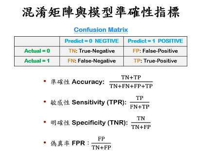

```{r results='hide', message=FALSE, warning=FALSE, echo=F}
# Formating Codes.  Do not change the codes in this chunk !!
rm(list=ls(all=T))
knitr::opts_chunk$set(comment = NA)
knitr::opts_knit$set(global.par = TRUE)
par(cex=0.8)
options(scipen=20, digits=5, width=80)
if(!require(pacman)) install.packages("pacman")
```
<hr>

```{r results='hide', message=FALSE, warning=FALSE}
pacman::p_load(caTools, ggplot2, dplyr)
D = read.csv("data/quality.csv")  # Read in dataset
set.seed(88)
split = sample.split(D$PoorCare, SplitRatio = 0.75)  # split vector
TR = subset(D, split == TRUE)
TS = subset(D, split == FALSE)
glm1 = glm(PoorCare ~ OfficeVisits + Narcotics, TR, family=binomial)
summary(glm1)
```
<br><hr>


### 【A】傳統準確性指標



<br>

##### Training Data

**預測機率 Predicted Probability (Training)**
```{r fig.height=3.2, fig.width=6.4}
par(cex=0.8)
pred = predict(glm1, type="response")
hist(pred)
abline(v=0.5, col='red')
```

**混淆矩陣 Confusion Matrix (Training)**
```{r}
cmx = table(Acture=TR$PoorCare, Predict=pred > 0.5)
cmx
```

**模型準確性指標 Accuracy Matrices (Training)**
```{r}
A2x2 = function(x, k=3) c(
  accuracy = sum(diag(x))/sum(x),
  sensitivity = as.numeric(x[2,2]/rowSums(x)[2]),
  specificity = as.numeric(x[1,1]/rowSums(x)[1])
  ) %>% round(k)
A2x2(cmx)
```
<br>

##### Testing Data

**預測機率 Predicted Probability (Testing)**
```{r fig.height=3.2, fig.width=6.4}
par(cex=0.8)
pred2 = predict(glm1, newdata=TS, type="response")
hist(pred2, 10)
abline(v=0.5, col='red')
```

**混淆矩陣 Confusion Matrix (Testing)**
```{r}
cmx2 = table(Acture=TS$PoorCare, Predict=pred2 > 0.5)
cmx2
```

**模型準確性指標 Accuracy Matrices (Testing)**
```{r}
sapply(list(Train=cmx, Test=cmx2), A2x2)
```
<br><br><hr>

### 【B】預測機率分佈、臨界機率、混淆矩陣


<br>

**預測機率分佈 (DPP) - Distribution of Predicted Probability (Training)**
```{r fig.height=3.2, fig.width=7}
data.frame(y=factor(TR$PoorCare), pred=pred) %>% 
  ggplot(aes(x=pred, fill=y)) + 
  geom_histogram(bins=20, col='white', position="stack", alpha=0.5) +
  ggtitle("Distribution of Predicted Probability (DPP)") +
  xlab("predicted probability")
```
<br><br><br><hr>

### 【C】作業曲線(ROC)與辨識率(AUC)

**ROC - Receiver Operation Curve**
```{r fig.height=4, fig.width=7.2}
par(mfrow=c(1,2), cex=0.8)
trAUC = colAUC(pred, y=TR$PoorCare, plotROC=T)
tsAUC = colAUC(pred2, y=TS$PoorCare, plotROC=T)
```

**AUC - Area Under Curve**
```{r}
c(trAUC, tsAUC)
```
<br><hr>

<p class="qiz">
<span style="font-size:24px">`r "\U1F5FF"` 練習： </span><br>
使用`TR$MemberID`以外的所有欄位，建立一個邏輯式回歸模型來預測`PoorCare`，並：<br>
&emsp; 【A】 分別畫出`Training`和`Testing`的`DPP`
```{r}
glm2 = glm(PoorCare ~ .-MemberID, TR, family=binomial)
predtr=predict(glm2,newdata = TR,type="response")
predts=predict(glm2,newdata = TS,type="response")
#training
data.frame(y=factor(TR$PoorCare), pred=predtr) %>% 
  ggplot(aes(x=pred, fill=y)) + 
  geom_histogram(bins=20, col='white', position="stack", alpha=0.5) +
  ggtitle("Distribution of Predicted Probability (DPP)") +
  xlab("predicted probability")
#testing
data.frame(y=factor(TS$PoorCare), pred=predts) %>% 
  ggplot(aes(x=pred, fill=y)) + 
  geom_histogram(bins=20, col='white', position="stack", alpha=0.5) +
  ggtitle("Distribution of Predicted Probability (DPP)") +
  xlab("predicted probability")
```
<br>
&emsp; 【B】 分別畫出`Training`和`Testing`的`ROC`
```{r}
par(mfrow=c(1,2), cex=0.8)
#training
trAUC = colAUC(predtr, y=TR$PoorCare, plotROC=T)
#testing
tsAUC = colAUC(predts, y=TS$PoorCare, plotROC=T)
```
<br>
&emsp; 【C】 分別算出`Training`和`Testing`的`ACC`、`SENS`和`SPEC`
```{r}
#training
cmx = table(Acture=TR$PoorCare, Predict=predtr > 0.5)
A2x2(cmx)
```

```{r}
#testing
cmx1 = table(Acture=TS$PoorCare, Predict=predts > 0.5)
A2x2(cmx1)
```
<br>
&emsp; 【D】 分別算出`Training`和`Testing`的`AUC`
```{r}
c(trAUC, tsAUC)
```
<br>
&emsp; 【E】 跟用兩個預測變數的模型相比，這一個模型有比較準嗎？
有的<br>
&emsp; 【F】 為什麼它比較準(或比較不準)呢？
因為這個模型使用較多的變數進行預測，將可能造成的誤差透過數量較多的變數稀釋掉了<br><br>
</p class="qiz">

<br><br><br><hr>
